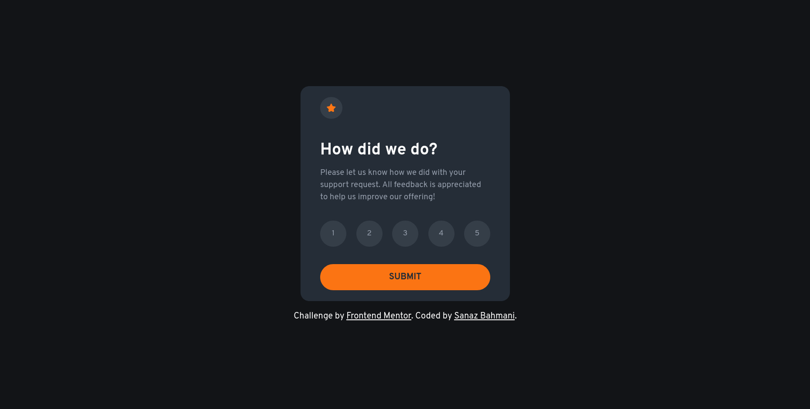

# Frontend Mentor - Interactive Rating Component Solution

This is my solution to the [Interactive rating component challenge on Frontend Mentor](https://www.frontendmentor.io/challenges/interactive-rating-component-koxpeBUmI). It's a great exercise in building accessible, responsive components while managing state effectively in React.

## Table of contents

- [Overview](#overview)
  - [The challenge](#the-challenge)
  - [Screenshot](#screenshot)
  - [Links](#links)
- [My process](#my-process)
  - [Built with](#built-with)
- [Author](#author)

## Overview

### The challenge

Users should be able to:

- View the optimal layout for the app depending on their device's screen size
- See hover states for all interactive elements
- Select and submit a rating from 1 to 5
- See a thank you state after submitting their selection

### Screenshot

### Links

- **Solution URL:** [View on Frontend Mentor](https://your-solution-url.com)
- **Live Site URL:** [Visit Live Site](https://your-live-site-url.com)

## My process

### Built with

- [React](https://reactjs.org/)
- [TypeScript](https://www.typescriptlang.org/)
- [Tailwind CSS](https://tailwindcss.com/)
- Semantic HTML5
- Mobile-first responsive design

### Author

- Frontend Mentor - [@SanazBHMN](https://www.frontendmentor.io/profile/SanazBHMN)
